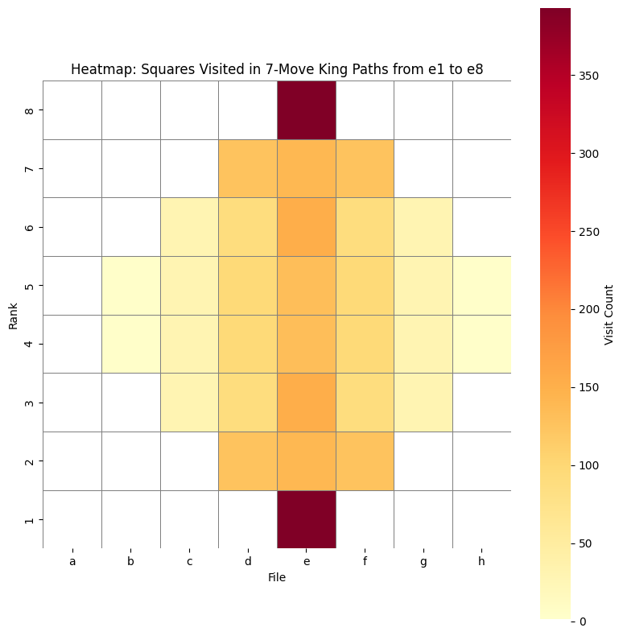

# King Paths on a Chessboard: Matrix vs DFS

[](https://colab.research.google.com/github/KalliaKL/king-paths-chess/blob/main/King_paths_starting_from_e4.ipynb)

This project calculates all distinct 7-move paths a king can take from `e1` to `e8` on a standard 8×8 chessboard. It uses two independent methods — one fast and mathematical, one exhaustive and visual — and compares their performance.

---

## What This Project Does

- Counts paths using matrix exponentiation of the adjacency matrix
- Enumerates paths with depth-first search (DFS)
- Generates a heatmap showing how often each square is visited
- Benchmarks time and memory used by both methods

---

## How to Run

You can either:

### Run in Google Colab (no setup required):
Click the badge above, or open the notebook directly in Colab.

### Or run locally:
```bash
python combined_king_paths_benchmarked.py
```

---

## Example Output

```
Total valid paths from e1 to e8 (Matrix): 393
Total valid paths from e1 to e8 (DFS):    393

--- Performance Report ---
Matrix method:
  Time taken: 0.0011 seconds
  Memory used: 4.30 KB

DFS method:
  Time taken: 1.2279 seconds
  Memory used: 1523.00 KB
```

---

## Heatmap Preview



---

## Files

| File | Description |
|------|-------------|
| `combined_king_paths_benchmarked.py` | Full logic: matrix, DFS, heatmap, benchmarking |
| `King_paths_starting_from_e4.ipynb`  | Interactive Colab notebook version |
| `combined_king_path_heatmap.png`     | Generated heatmap image |
| `README.md`                          | Project overview and launch link |

---

## Dependencies

No manual setup required in Colab.

For local use:
- `numpy`
- `matplotlib`
- `seaborn`

---

## License

This project is copyrighted.
All rights reserved.  
For personal or academic use only. Contact the author for reuse permission.

---

## Author

KalliaKL
